# FarmHub - Connecting Farmers & Consumers

FarmHub is a Flutter-based cross-platform mobile application designed to eliminate middlemen in agriculture by directly connecting farmers and consumers. The app provides real-time inventory management, product listing, and a marketplace where consumers can browse, chat, and buy fresh produce straight from nearby farms.

## Features
 Firebase Authentication for login/signup
- Consumer and Farmer modes
- Farmer Dashboard for inventory and sales
- Consumer Marketplace for browsing and purchasing products
- Real-time data with Firebase Firestore
- Product images uploaded using Cloudinary
- Location-based farmer discovery
- Cart and Payment Integration

## 📸 Screenshots

### 🔐 Authentication Screens

| Consumer Login | Consumer Signup | Farmer Login | Farmer Signup |
|----------------|------------------|--------------|----------------|
| 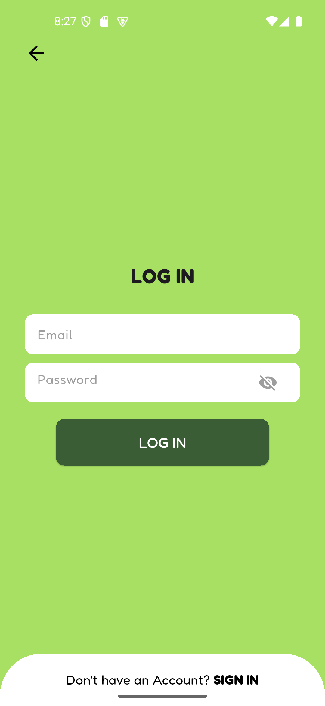 | 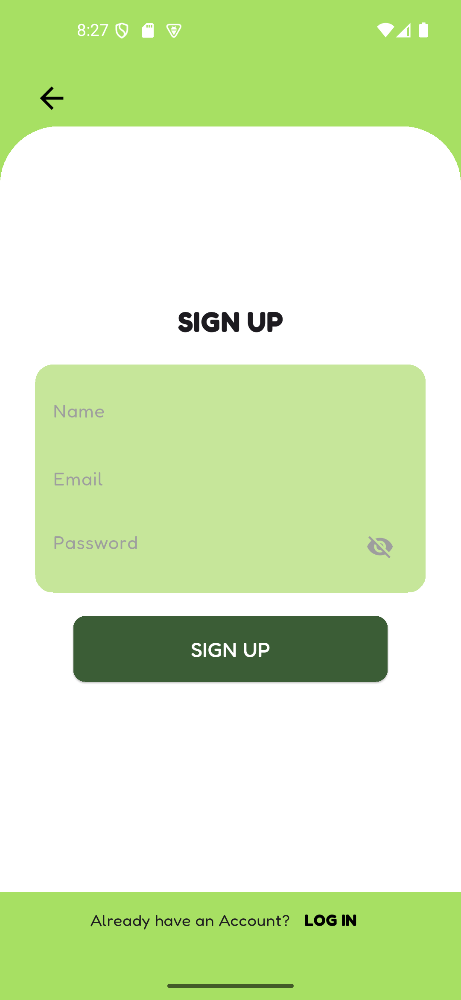 |  | 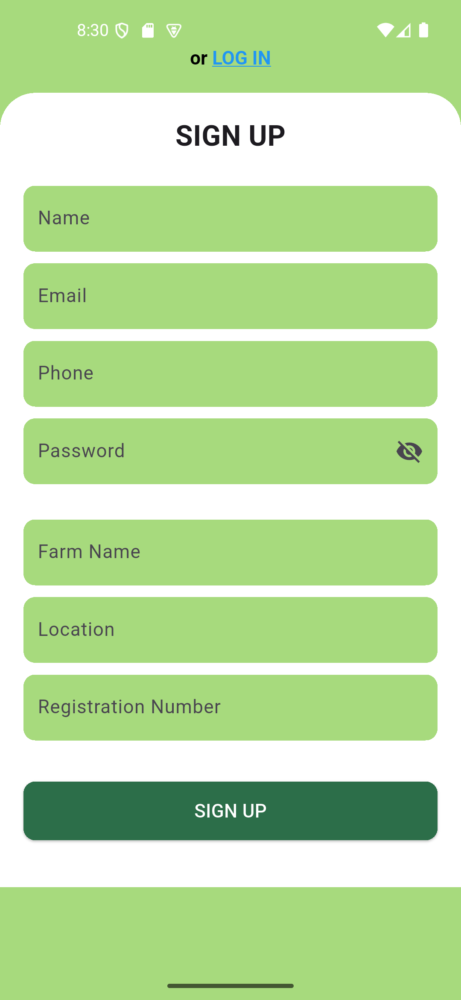 |

---

### 🧑‍🌾 Farmer Side Screens

| Dashboard | Inventory | Add Product | Profile |
|-----------|-----------|-------------|---------|
| 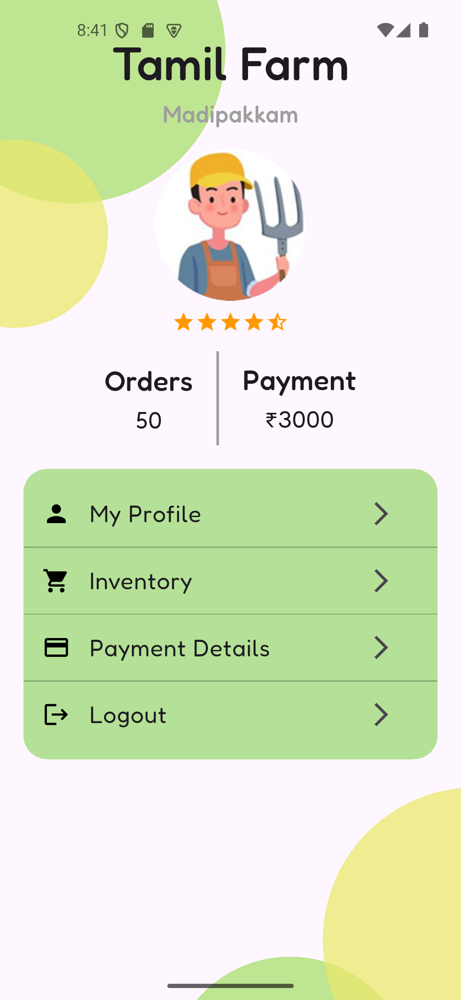 | 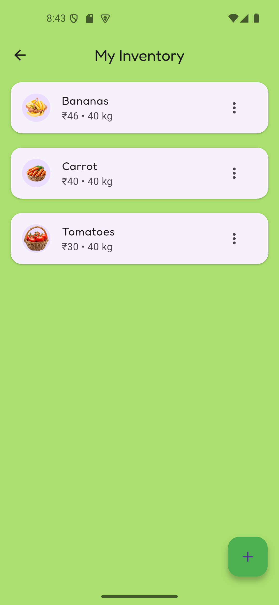 | 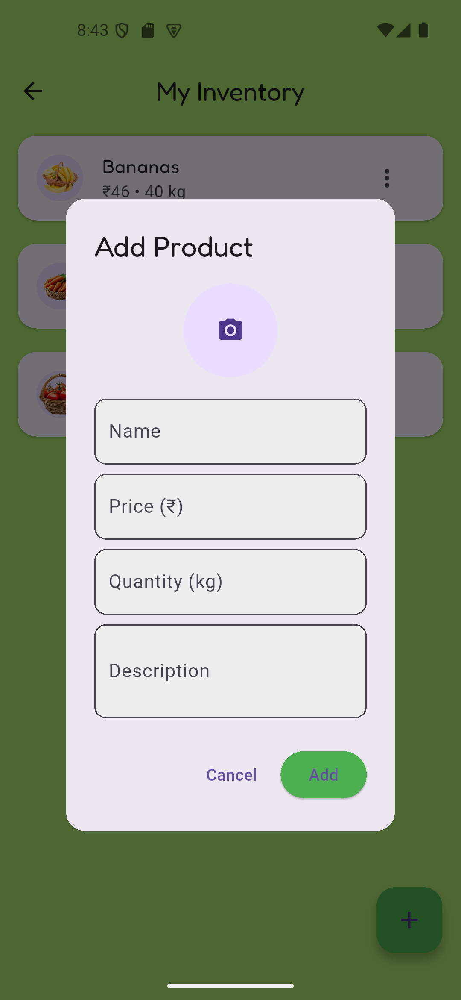 | 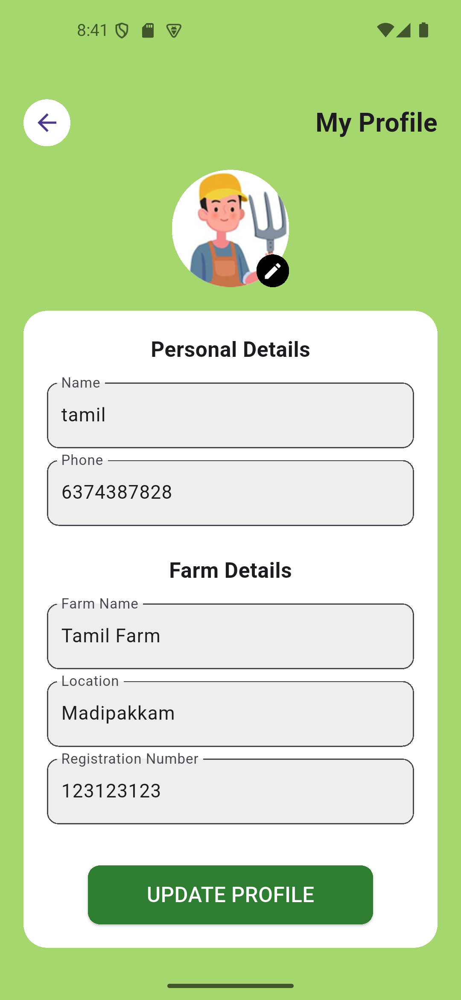 |

| Payment Details |
|-----------------|
| 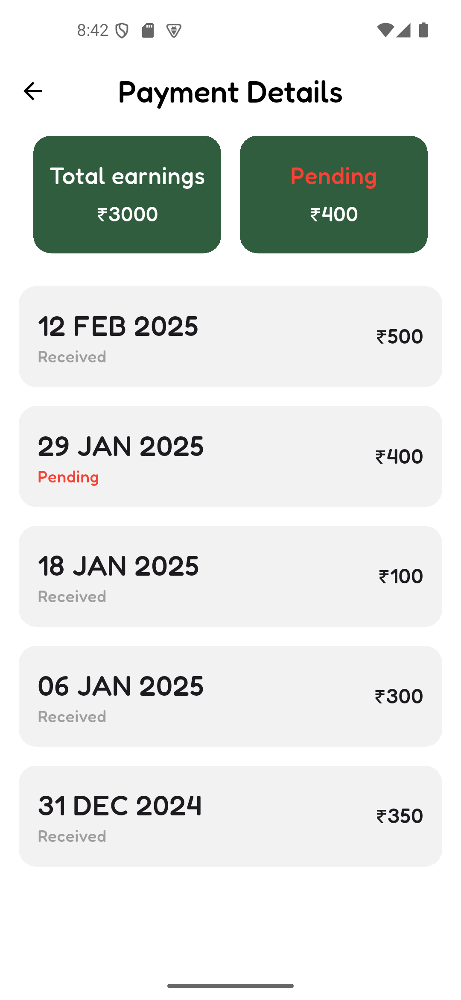 |

---

### 🛒 Consumer Side Screens

| Home Page | Marketplace | Cart | Checkout |
|-----------|-------------|------|----------|
| 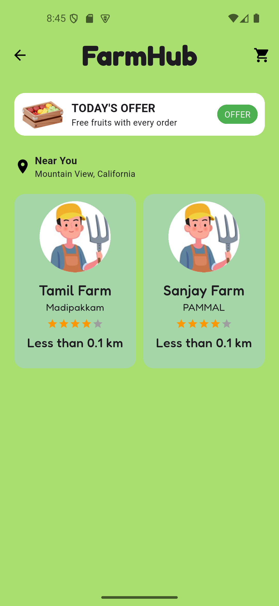 | 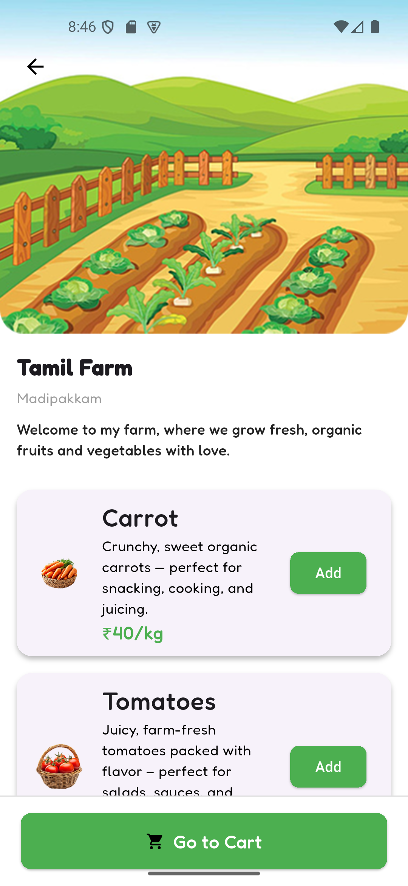 | 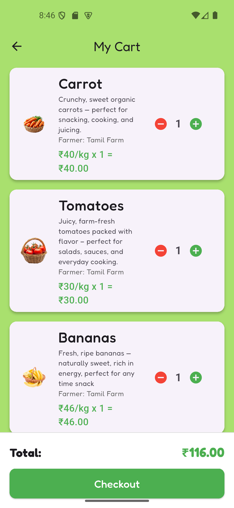 | 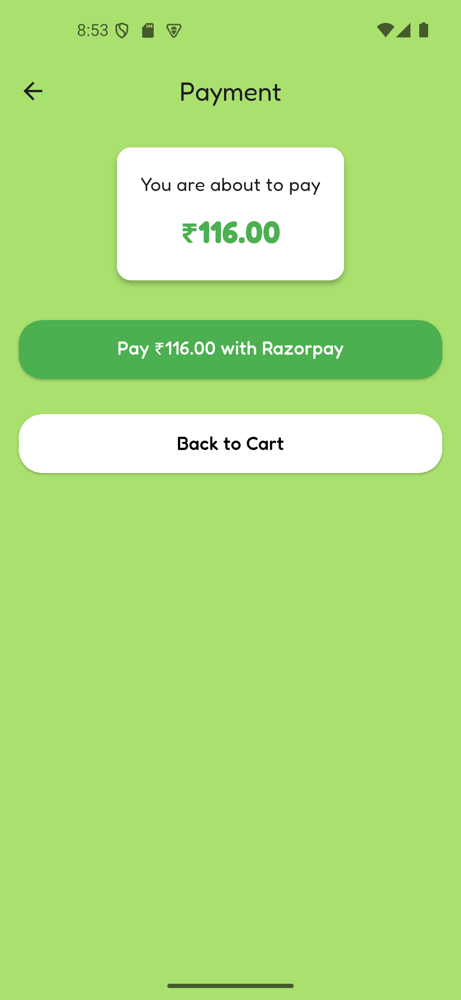 |

| Order Confirmation |
|--------------------|
| 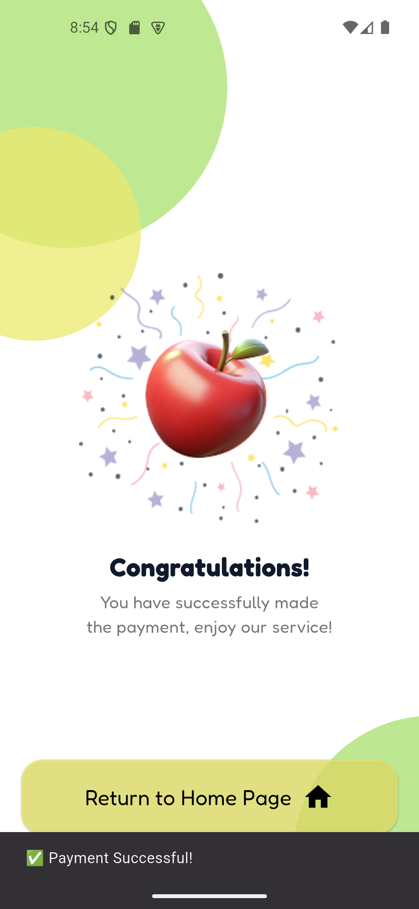 | 

---

### 📍 Location Access

| Location Access Prompt |
|------------------------|
| 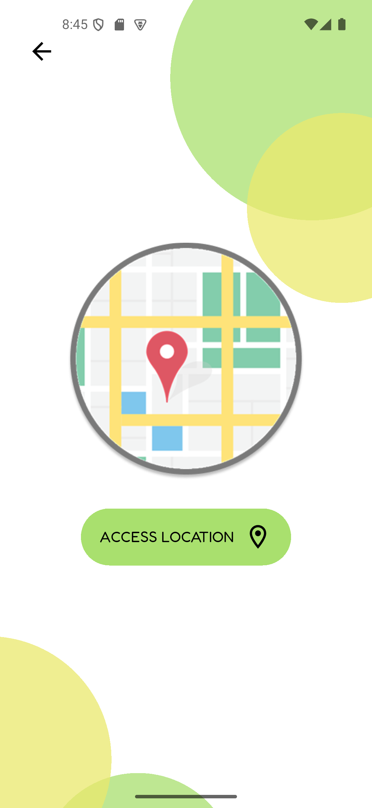 |

---

> 📝 Make sure your `screenshots/` folder contains these images, and the file names match exactly. You can adjust the markdown if your file names are different.

---

> 📝 Make sure to save all images in a folder called `screenshots/` at your project root. Rename the screenshots to match the filenames above, or edit the markdown if you use different names.

---

> 📝 Place all your screenshots in a folder called `screenshots/` at the root of your repo. Make sure the file names match those used above, or adjust the markdown accordingly.

This project is a starting point for a Flutter application.

A few resources to get you started if this is your first Flutter project:

- [Lab: Write your first Flutter app](https://docs.flutter.dev/get-started/codelab)
- [Cookbook: Useful Flutter samples](https://docs.flutter.dev/cookbook)

For help getting started with Flutter development, view the
[online documentation](https://docs.flutter.dev/), which offers tutorials,
samples, guidance on mobile development, and a full API reference.
